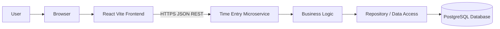

# Simple App Architecture Guide

This guide explains how a fresher can design a small application with:

- A web frontend
- A microservice backend
- A database

The examples use technologies similar to Chronos:

- **Frontend**: React with Vite
- **Backend**: Java with Spring Boot
- **Database**: PostgreSQL
- **Communication**: HTTP and JSON using REST APIs

The same architecture ideas also work with Angular, Vue, Node.js, .NET, Python, or another backend technology.

## 1. Start With The User Journey

Before choosing tools, write down what a user should be able to do. For example:

1. Open the website.
2. See a list of time entries.
3. Create a new time entry.
4. Edit or delete an entry.
5. Refresh the page and still see the saved entries.

These actions help you identify the parts of the system you need. Avoid designing services for features that do not exist yet.

## 2. The Three Main Parts

A simple application can be split into three layers:

```text
Browser
  |
  | HTTP requests containing JSON
  v
Frontend application
  |
  | REST API calls
  v
Backend microservice
  |
  | SQL queries through a data-access library
  v
Database
```

### Frontend

The frontend is the part the user sees and interacts with. It should be responsible for:

- Displaying pages, forms, buttons, and messages
- Collecting input from the user
- Calling backend API endpoints
- Showing loading, success, empty, and error states
- Performing simple input validation for a better user experience

The frontend should not connect directly to the database. Keeping database access in the backend protects data and keeps business rules in one place.

### Backend Microservice

A backend microservice is a small independently runnable application that owns a focused business capability. For a time-keeping app, one possible service is a **Time Entry Service**.

It should be responsible for:

- Receiving HTTP requests
- Validating input on the server
- Applying business rules
- Reading and writing data
- Returning clear HTTP status codes and JSON responses
- Protecting endpoints when authentication is added

A service should not expose database tables as its public API. Define API requests and responses around business actions instead.

### Database

The database stores information after the application stops running. A relational database such as PostgreSQL is a good starting choice for structured records.

The database should be responsible for:

- Storing durable data
- Enforcing required fields and relationships
- Creating indexes for common searches
- Supporting transactions when several changes must succeed together

The database should not be exposed directly to the browser or the public internet.

## 3. A Small Example Architecture

For a first version, use one frontend, one backend service, and one database:



A useful request flow looks like this:

1. The user submits a form in the browser.
2. React sends `POST /api/time-entries` with JSON.
3. The backend validates the request.
4. The backend applies business rules.
5. The repository saves the record in PostgreSQL.
6. The backend returns `201 Created` and the new record.
7. React updates the screen.

## 4. Suggested Project Layout

Keep the frontend and backend separate so each can be developed and deployed independently:

```text
my-app/
  frontend/
    package.json
    src/
      components/
      pages/
      services/
      App.jsx
  time-entry-service/
    pom.xml
    src/main/java/
      .../controller/
      .../service/
      .../repository/
      .../model/
      .../config/
    src/main/resources/
      application.properties
      db/migration/
    src/test/java/
  docker-compose.yml
  README.md
```

### What The Backend Folders Mean

- `controller`: Receives HTTP requests and returns responses. Keep it thin.
- `service`: Contains business rules and coordinates work.
- `repository`: Reads and writes data. Do not put business rules here.
- `model`: Defines request objects, response objects, and persistence entities.
- `config`: Defines application settings and integrations.
- `db/migration`: Contains versioned database migrations.

A beginner-friendly rule is: **Controller -> Service -> Repository -> Database**. Avoid skipping layers until you understand why the shortcut is safe.

## 5. Design The API First

Write a small API contract before implementing screens. For a time-entry service:

| Method | Endpoint | Purpose | Success response |
| --- | --- | --- | --- |
| `GET` | `/api/time-entries` | List entries | `200 OK` with an array |
| `GET` | `/api/time-entries/{id}` | Get one entry | `200 OK` with an object |
| `POST` | `/api/time-entries` | Create an entry | `201 Created` with the object |
| `PUT` | `/api/time-entries/{id}` | Update an entry | `200 OK` with the object |
| `DELETE` | `/api/time-entries/{id}` | Delete an entry | `204 No Content` |

Example request:

```json
{
  "description": "Implement dashboard",
  "startedAt": "2026-08-22T09:00:00Z",
  "endedAt": "2026-08-22T10:30:00Z"
}
```

Example response:

```json
{
  "id": 42,
  "description": "Implement dashboard",
  "startedAt": "2026-08-22T09:00:00Z",
  "endedAt": "2026-08-22T10:30:00Z",
  "durationMinutes": 90
}
```

Use consistent error responses. For example:

```json
{
  "status": 400,
  "message": "endedAt must be after startedAt"
}
```

Common HTTP statuses:

- `200 OK`: The request succeeded.
- `201 Created`: A new resource was created.
- `204 No Content`: The request succeeded without a response body.
- `400 Bad Request`: The input is invalid.
- `401 Unauthorized`: The user is not logged in.
- `403 Forbidden`: The user is logged in but not allowed.
- `404 Not Found`: The resource does not exist.
- `500 Internal Server Error`: An unexpected server error occurred.

## 6. Design The Database

Start with a small table. For example:

```text
users
  id
  email
  display_name

 time_entries
  id
  user_id
  description
  started_at
  ended_at
  created_at
  updated_at
```

Important database decisions:

- Give each record a primary key such as `id`.
- Use a foreign key such as `user_id` for relationships.
- Make required columns `NOT NULL`.
- Store timestamps consistently, preferably in UTC.
- Add an index for fields used frequently in filters, such as `user_id` and `started_at`.
- Use migrations instead of manually changing production databases.

Do not store passwords as plain text. When authentication is added, use a trusted identity provider or a well-tested password hashing library.

## 7. Build It In Small Steps

A practical implementation order is:

1. Create the backend application and confirm it starts.
2. Add a health endpoint such as `GET /api/health`.
3. Create the database and configure a local connection.
4. Add a migration for the first table.
5. Add the repository and service for one use case.
6. Add the controller and test it with an API client.
7. Create the frontend page with sample data.
8. Replace sample data with a frontend API call.
9. Add loading, empty, validation, and error states.
10. Add automated tests and a production build.

Build one complete vertical slice first. For example, make "create and list one time entry" work from the browser through the backend and into the database before adding every other feature.

## 8. Local Development

Run each part separately during development:

```text
Frontend:  http://localhost:5173
Backend:   http://localhost:8080
Database:  localhost:5432
```

The frontend should call the backend through a relative URL such as `/api/time-entries`. In development, Vite can proxy `/api` to the backend. In production, use a reverse proxy or serve both applications behind the same domain.

Keep secrets out of source control. Use environment variables or local configuration files that are excluded from Git:

```text
DATABASE_URL=jdbc:postgresql://localhost:5432/chronos
DATABASE_USER=chronos_app
DATABASE_PASSWORD=use-a-local-secret
```

Never commit real passwords, API keys, or tokens.

## 9. Testing The Architecture

Test each layer at the most useful level:

- **Frontend component tests**: Check that forms and screens render correctly.
- **Frontend integration tests**: Check that a user action makes the expected API call.
- **Backend unit tests**: Check business rules without starting the whole application.
- **Backend integration tests**: Check controllers, persistence, and database behavior together.
- **API tests**: Check request and response contracts.
- **End-to-end tests**: Check the complete browser-to-database user journey.

At minimum, test:

- Valid creation of a record
- Invalid or missing input
- Request for a missing record
- Update and delete behavior
- Database constraint failures
- Backend unavailable from the frontend

## 10. Production Considerations

A local three-part design is enough to learn and build the first version. Before production, add:

- HTTPS
- Authentication and authorization
- Input validation and output encoding
- Database backups and migration management
- Structured logs
- Health and readiness checks
- Metrics and tracing
- Rate limiting where appropriate
- Separate configuration for development, test, and production
- CI checks for tests, dependency vulnerabilities, and builds
- Container images or another repeatable deployment method

A microservice is not automatically better than a modular monolith. Choose a separate service when independent deployment, scaling, ownership, or fault isolation provides a real benefit. For a small team, starting with one well-structured backend service is usually easier to operate than creating many tiny services.

## 11. Resources To Learn From

### Web And API Basics

- [MDN HTTP overview](https://developer.mozilla.org/en-US/docs/Web/HTTP/Overview)
- [MDN HTTP status codes](https://developer.mozilla.org/en-US/docs/Web/HTTP/Reference/Status)
- [MDN JSON guide](https://developer.mozilla.org/en-US/docs/Learn_web_development/Core/Scripting/JSON)
- [REST API concepts](https://restfulapi.net/)

### Frontend

- [React Learn](https://react.dev/learn)
- [Vite Getting Started](https://vite.dev/guide/)
- [MDN JavaScript Guide](https://developer.mozilla.org/en-US/docs/Web/JavaScript/Guide)

### Backend And Java

- [Spring Boot documentation](https://docs.spring.io/spring-boot/index.html)
- [Spring REST service guide](https://spring.io/guides/gs/rest-service)
- [Spring Data JPA guide](https://spring.io/guides/gs/accessing-data-jpa)
- [Maven Getting Started Guide](https://maven.apache.org/guides/getting-started/)

### Databases

- [PostgreSQL tutorial](https://www.postgresql.org/docs/current/tutorial.html)
- [PostgreSQL SQL commands](https://www.postgresql.org/docs/current/sql.html)
- [Martin Fowler: Patterns of Distributed Systems](https://martinfowler.com/articles/patterns-of-distributed-systems/)

### API Documentation And Tools

- [OpenAPI specification](https://spec.openapis.org/oas/latest.html)
- [Swagger Editor](https://editor.swagger.io/)
- [Postman learning center](https://learning.postman.com/docs/getting-started/overview/)

### Security

- [OWASP Top 10](https://owasp.org/www-project-top-ten/)
- [OWASP API Security Top 10](https://owasp.org/www-project-api-security/)
- [Spring Security documentation](https://docs.spring.io/spring-security/reference/index.html)

## Beginner Checklist

Before calling the first version complete, confirm:

- [ ] The frontend starts with one documented command.
- [ ] The backend starts with one documented command.
- [ ] The database can be created from documented steps.
- [ ] The frontend never connects directly to the database.
- [ ] API endpoints and JSON examples are documented.
- [ ] Invalid input returns a useful error.
- [ ] Database changes use migrations.
- [ ] Secrets are not committed.
- [ ] Backend and frontend tests run successfully.
- [ ] A new developer can follow the README and run the app without asking for hidden setup steps.
